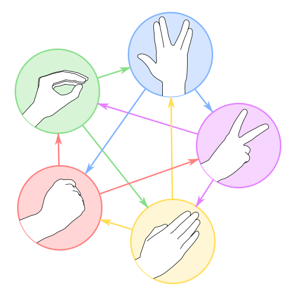

# Rock-Paper-Scissors-Lizard-Spock

## Project Description

This is a game of Rock-Paper-Scissors-Lizard-Spock.
(Try to guess where did I get the idea from.😎)

### Here are the rules

Scissors cuts paper, paper covers rock, rock crushes lizard,
lizard poisons Spock, Spock smashes scissors, scissors
decapitates lizard, lizard eats paper, paper disproves Spock,
Spock vaporizes rock, and as it always has, rock crushes
scissors.

## Technologies used:

1. HTML
2. CSS
3. JavaScript (Vanilla)
4. Bootstrap

## Running the Project:

You can easily run the project on live server
If you don't know much about live server, you can check out this

- [live server](https://www.freecodecamp.org/news/vscode-live-server-auto-refresh-browser/)

## Contributing:

To contribute to this project, you can fork it on github and make a pull request.
The issues range from easy to advanced and carry points.
### Create a valid and seperate PR for each issue you solve before the deadline and you will get the points it carries.
Solve as many issues as you can and as fast as you can to stand a chance of winning SCHWAGS.

# Happy FOSS WEEKEEND!
